# Collaborative Notes

## Github Link: [Collaborative Notes](https://github.com/YanivGabay/note-sharing-app)

## Youtube Link: [Collaborative Notes Showcase](https://youtu.be/fppggEKl9X4)

## The Development Process in General

### Yaniv Gabay

This document will cover the development process of the Collaborative Notes app, which allows users to create, edit, and delete notes in real-time. The app also includes features like user authentication, note history tracking and reverting, and category filtering.

Hopefully this can act as a guide for the simple foundations of a collaborative note-taking app, and provide insights into the development process, mainly about how to use Firebase for authentication and live data storage, and how to use React with it.

The first decision was choosing the framework. We were instructed to use Firebase for authentication and live data storage, so I chose React for the frontend and Firebase for the backend.

I chose React because:

- I have some prior experience with it.
- I wanted to add another project to my portfolio and practice further.
- React allows for easy creation of single-page applications, with straightforward state management and component-based design.

For CSS, I opted for Bootstrap because:

- It's user-friendly and familiar.
- While I could have used React-Bootstrap, I decided to stick with the original Bootstrap for this project.
- Although I generally prefer MUI (a component library for React), I wanted to use Bootstrap in this instance.
  
General resources I used included:

- [React Documentation](https://reactjs.org/docs/getting-started.html)
- [Firebase Firestore Quickstart](https://firebase.google.com/docs/firestore/quickstart)
- [Firebase Auth Start](https://firebase.google.com/docs/auth/web/start)
- [Bootstrap Introduction](https://getbootstrap.com/docs/5.3/getting-started/introduction/)
- [ChatGPT](https://chatgpt.com/)
- [Environment Variables in Node.js](https://medium.com/the-node-js-collection/making-your-node-js-work-everywhere-with-environment-variables-2da8cdf6e786)
  
## The Development Process in Detail

Initially, we consulted ChatGPT to help design the project in terms of needs, prerequisites, and initial steps.
Results:
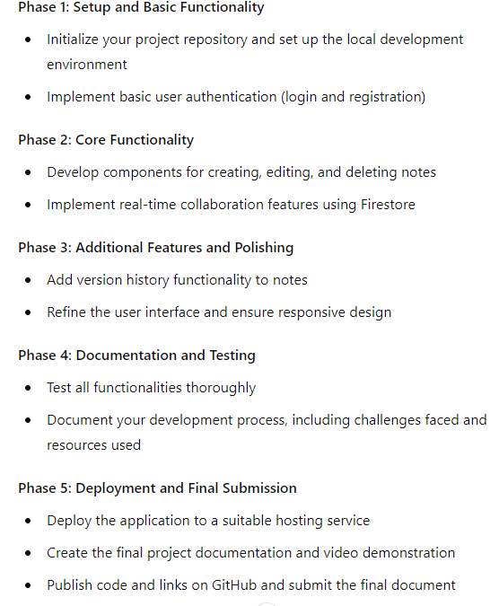

After gaining a clearer understanding of what was required, and choosing React, Bootstrap, and Firebase as our tools, we began by creating the React application:

```bash
npx create-react-app collaborative-notes
```

We then executed `npm start` to launch the app and view the default React setup.

Next, I organized the necessary structure for the app:

- `components`: For React components.
- `pages`: For application pages.
- `hooks`: For custom hooks.

We then added Firebase and React Router to the application for backend integration and navigation management:

```bash
npm install firebase react-router-dom
```

We initialized a Git repository locally to start version control:

```bash
git init
```

The next step was to set up Firebase authentication. Before coding, it was necessary to configure Firebase through the Firebase console. This involved:

- Creating a new project.
- Adding a web app to this project.
- Configuring Firebase Authentication.

## Firebase Console

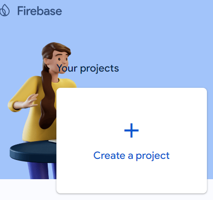

## Project Setup

### Naming the Project and Proceeding without Google Analytics

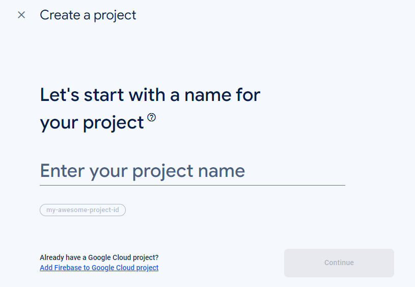

### Setup Progress

Analytics is great if you want to track user behavior, but for this project, we proceeded without it:

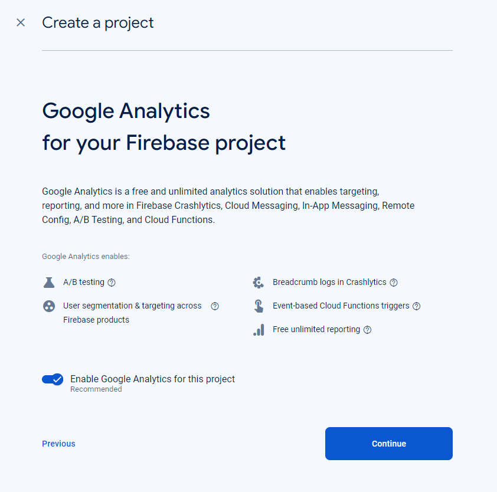

It takes some time to set up the project:

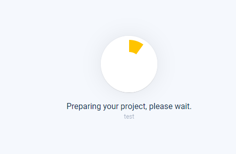

## Adding Authentication Service

### Authentication Setup

Project Overview:

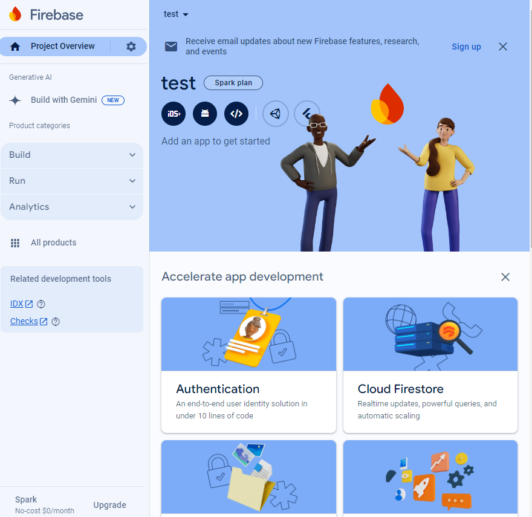

Press Build:

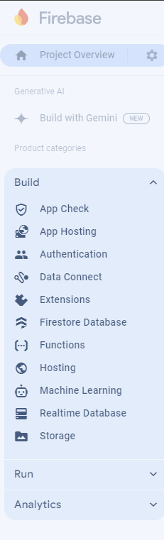
Press "Authentication" to set up the authentication service.

### Getting Started with Authentication

Press Get Started to begin setting up authentication:

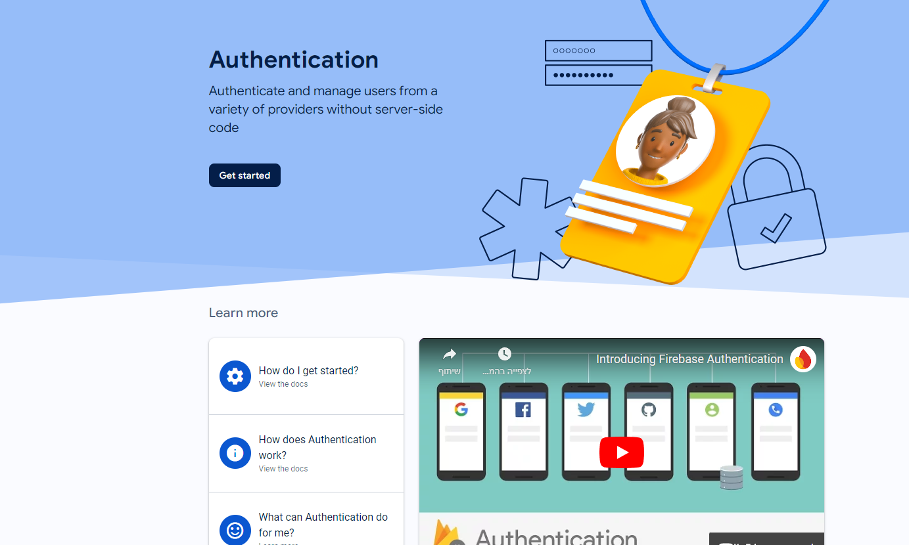

### Setting Up Email/Password Authentication

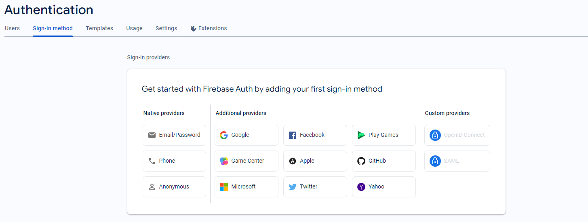

Press Email/Password to enable this authentication method.

Press Enable on the next screen to activate the service:

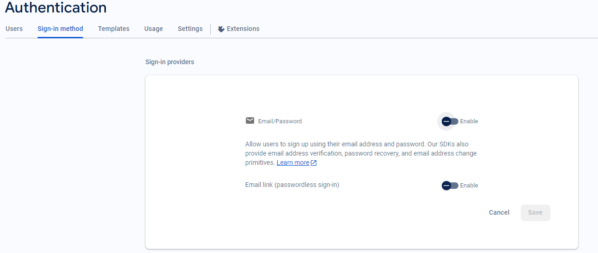

## Reviewing the Authentication API Documentation

The Firebase documentation provides a detailed guide on how to use the authentication service:

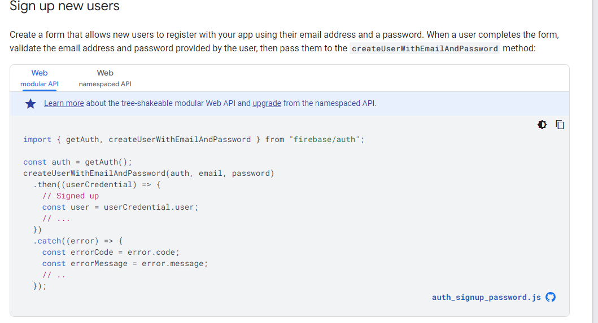

At this point, I strongly recommended using a `.env` file to store the Firebase configuration securely, ensuring it was included in the `.gitignore` file to prevent exposure on the public GitHub repository.
You can check the guide in the resources section for more information on environment variables in Node.js.

## Firebase Configuration and Authentication

Our `firebase-config.js` file looks like this:

```javascript
import { initializeApp } from 'firebase/app';
import { getAuth } from 'firebase/auth';
import { getFirestore } from 'firebase/firestore';
import { getDatabase } from "firebase/database";

const firebaseConfig = {
  apiKey: process.env.REACT_APP_FIREBASE_API_KEY,
  authDomain: process.env.REACT_APP_FIREBASE_AUTH_DOMAIN,
  projectId: process.env.REACT_APP_FIREBASE_PROJECT_ID,
  storageBucket: process.env.REACT_APP_FIREBASE_STORAGE_BUCKET,
  messagingSenderId: process.env.REACT_APP_FIREBASE_MESSAGING_SENDER_ID,
  appId: process.env.REACT_APP_FIREBASE_APP_ID
};

// Validate config
if (!firebaseConfig.apiKey) throw new Error("Missing Firebase configuration. Check .env file.");
if (!firebaseConfig.authDomain) throw new Error("Missing Firebase configuration. Check .env file.");
if (!firebaseConfig.projectId) throw new Error("Missing Firebase configuration. Check .env file.");
if (!firebaseConfig.storageBucket) throw new Error("Missing Firebase configuration. Check .env file.");
if (!firebaseConfig.messagingSenderId) throw new Error("Missing Firebase configuration. Check .env file.");
if (!firebaseConfig.appId) throw new Error("Missing Firebase configuration. Check .env file.");

// Initialize Firebase
const app = initializeApp(firebaseConfig);

// Export services
export const auth = getAuth(app);
export const firestore = getFirestore(app);
const database = getDatabase(app);
```

To manage authentication, we use a custom hook and a context to maintain user state across the app. If you're new to React hooks and context, it's beneficial to review the official documentation:

- [React Context](https://react.dev/reference/react/useContext)
- [React useEffect](https://react.dev/reference/react/useEffect)

Here's how we set up our `AuthContext.js`:

```javascript
import React, { createContext, useContext, useEffect, useState } from 'react';
import { auth } from './firebase-config';

const AuthContext = createContext();

export const useAuth = () => useContext(AuthContext);

export const AuthProvider = ({ children }) => {
  const [currentUser, setCurrentUser] = useState(null);
  const [loading, setLoading] = useState(true); // Initialize loading state

  useEffect(() => {
    const unsubscribe = auth.onAuthStateChanged(user => {
      setCurrentUser(user);
      setLoading(false); // Update loading state when user is fetched
    });
    return unsubscribe;
  }, []);

  const value = { currentUser, loading };

  return (
    <AuthContext.Provider value={value}>
      {children}
    </AuthContext.Provider>
  );
};
```

This setup allows any component within our app to access the `currentUser` and monitor authentication state.

### Building the Login and Registration Pages

For the user interface components such as the login and registration pages, and the navigation bar, you might consider generating templates using tools like ChatGPT, or pulling from a UI library. Here are some suggested image placeholders for such templates:
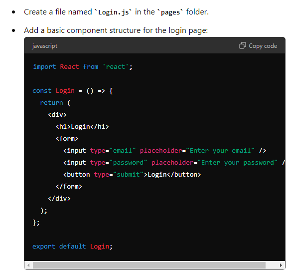
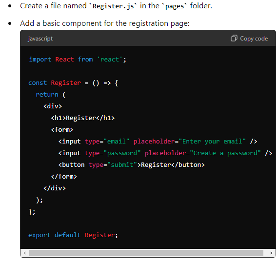

## Protected Route and Routing Setup

We use a **Protected Route** component to manage access based on authentication status. This component redirects users to the login page if they are not logged in:

```javascript
import React from 'react';
import { Navigate } from 'react-router-dom';
import { useAuth } from './AuthContext';

const ProtectedRoute = ({ children }) => {
  const { currentUser, loading } = useAuth();

  if (loading) {
    return <div>Loading...</div>; // Display a loading spinner or message while checking user state
  }

  if (!currentUser) {
    return <Navigate to="/register" />; // Redirect to register if no user is logged in
  }

  return children; // Render children components if user is authenticated
};

export default ProtectedRoute;
```

The `ProtectedRoute` leverages our `AuthContext` to check if a user is logged in, demonstrating the utility of React context for global state management across components.

### Application Routing

For navigation within our app, we utilize React Router. Here's how we set up the routes in our main `App.js` file:

```javascript
import React from 'react';
import { BrowserRouter as Router, Routes, Route } from 'react-router-dom';
import { AuthProvider } from './AuthContext';
import { NotificationProvider } from './NotificationContext';
import ToastNotification from './components/ToastNotification';
import Home from './pages/Home';
import Login from './pages/Login';
import Register from './pages/Register';
import StatusPage from './pages/StatusPage';
import Header from './components/Header';

function App() {
  return (
    <AuthProvider>
      <NotificationProvider>
        <Router>
          <ToastNotification />
          <Header />
          <Routes>
            <Route path="/" element={<ProtectedRoute><Home /></ProtectedRoute>} />
            <Route path="/login" element={<Login />} />
            <Route path="/status" element={<StatusPage />} />
            <Route path="/register" element={<Register />} />
          </Routes>
        </Router>
      </NotificationProvider>
    </AuthProvider>
  );
}
export default App;
```

### Handling Authentication on Login and Registration

The login and registration processes are handled by respective functions that interact with Firebase Auth. These functions redirect the user to a status page upon completion, indicating whether the operation was successful or if an error occurred:

#### Login Function

```javascript
const handleLogin = async (e) => {
  e.preventDefault();
  try {
    const auth = getAuth();
    await signInWithEmailAndPassword(auth, email, password);
    navigate('/status', {
      state: { status: 'Success', message: 'You have logged in successfully!' }
    });
  } catch (error) {
    navigate('/status', {
      state: { status: 'Error', message: error.message }
    });
  }
};
```

#### Registration Function

```javascript
const handleRegister = async (e) => {
  e.preventDefault();
  try {
    const auth = getAuth();
    await createUserWithEmailAndPassword(auth, email, password);
    navigate('/status', {
      state: { status: 'Success', message: 'You have registered successfully!' }
    });
  } catch (error) {
    navigate('/status', {
      state: { status: 'Error', message: error.message }
    });
  }
};
```

They are both using the Firebase auth service to register and log in the user. The StatusPage is just a page that shows a message to the user, indicating whether they registered or logged in successfully or not.

For the rest of the code, you can check the repository/files themselves.

After you have written all of it, when you go to the authentication tab in the Firebase console, you can see the users that have registered to your app. For example:
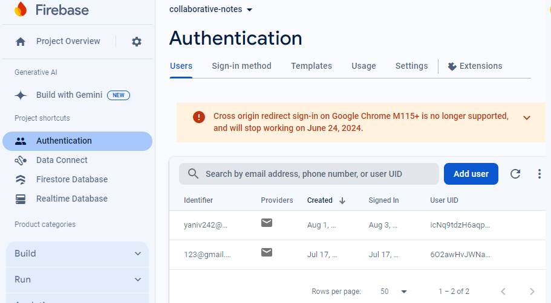
You can check it out live or add manual users through the console.

If everything is working according to plan, now users can register and log in to your app, and you can see them in the Firebase console.

So the next step was to add the notes functionality to the app.

We asked ChatGPT to help us design the notes functionality, and we got the following

#### Notes Functionality Design

##### Consultation with ChatGPT on notes functionality

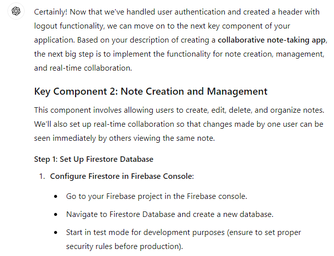
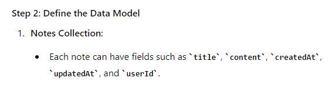
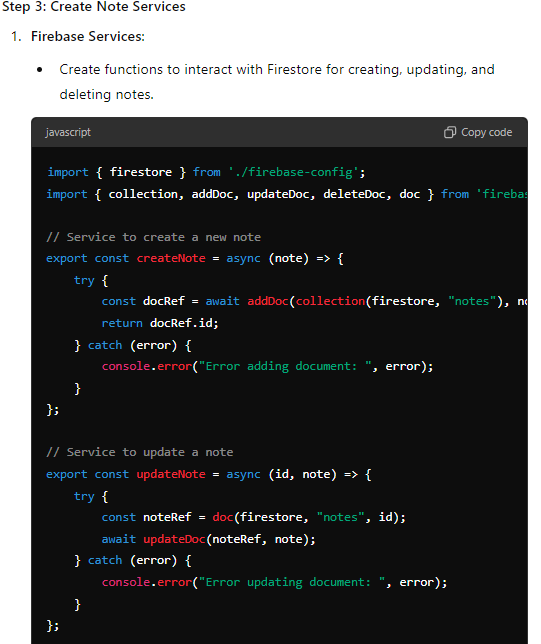
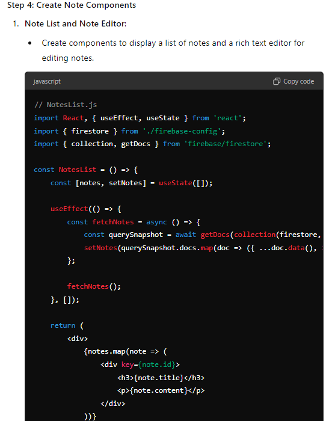
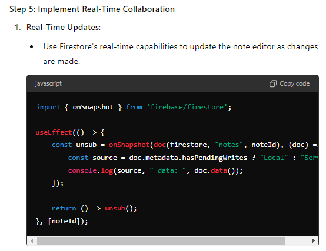

so after the results from ChatGPT, we started actually implementing the notes functionality.

#### Actual Database Setup

Basically, the first step is going to the Firebase console and adding a new collection to the Firestore database.
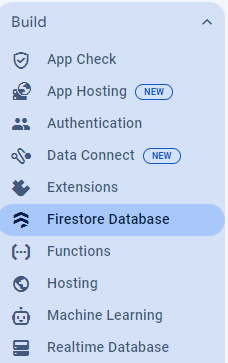
Press "Create database."
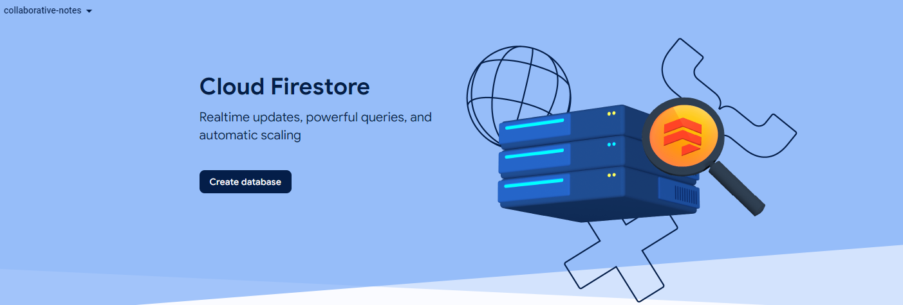
Choose a location; I chose Europe.
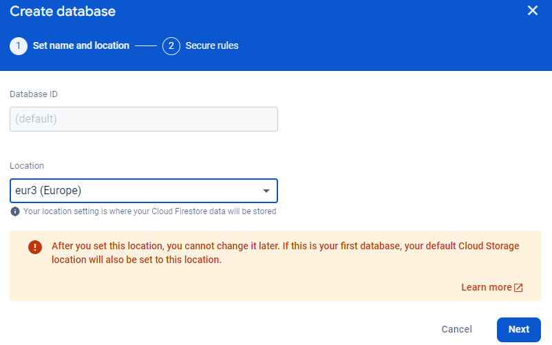
Start in test mode, because we are not going to use it in production yet.
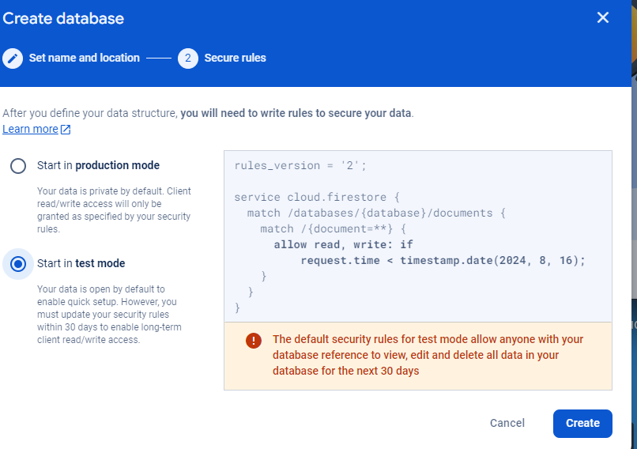
After creating the database, we can add a collection to it and add documents to the collection.
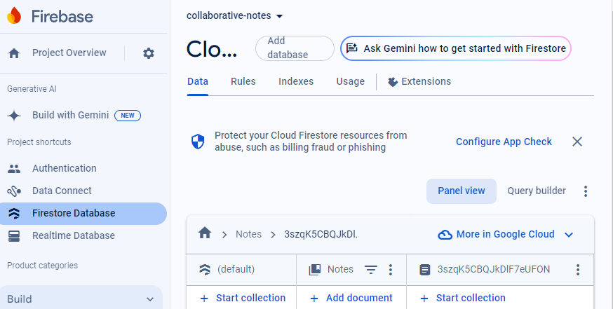
You can also view data "live" in the console and add data to the collection.

At this point, I recommend creating a hook that will handle the notes service for us.
Let's go over the basic functionality of the notes service:

- **Add Note**

  ```javascript
  const addNote = async (noteData) => {
    await addDoc(collection(firestore, "Notes"), {
      ...noteData,
      isEditing: false,
      editedBy: currentUser?.email || "Anonymous", // Ensure user is logged in
      updatedAt: new Date()  // Setting updatedAt during creation
    });
  };
  ```

- **Delete Note**

  ```javascript
  const deleteNote = async (id) => {
    await deleteDoc(doc(firestore, "Notes", id));
  };
  ```

To avoid double editing from two users on the same note at the same time, as soon as someone presses edit on a certain note we update the `isEditing` field to true, and when they are done editing, we update it back to false.

  ```javascript
  const startEditing = async (id) => {
    await updateDoc(doc(firestore, "Notes", id), { isEditing: true });
  };

  const cancelEditing = async (id) => {
    await updateDoc(doc(firestore, "Notes", id), { isEditing: false });
  };
  ```

The `useEffect` hook listens to the notes collection in the Firestore database and updates the notes state when the collection changes, using the `onSnapshot` function from the Firestore library.

  ```javascript
    useEffect(() => {
    const notesCollection = collection(firestore, "Notes");
    return onSnapshot(notesCollection, (snapshot) => {
      const fetchedNotes = snapshot.docs.map(doc => ({
        id: doc.id,
        ...doc.data(),
        createdAt: doc.data().createdAt.toDate(),
        updatedAt: doc.data().updatedAt.toDate()
      }));
      setNotes(fetchedNotes);
      setCategories([...new Set(snapshot.docs.map(doc => doc.data().category || 'General'))]);
    });
  }, []);
  ```

The notes state is an array of objects, each object is a note, with the following fields:
author,category,content,createdAt,editedBy,id,isEditing,updatedAt

Of course, you can add more fields if you want, but this is the basic structure of the note object. Also, an important note: I DID NOT use rules in the Firestore database, so anyone can read and write to the database. This is not recommended in production, but for this project, it is fine. Additionally, this does not limit the structure of the note object, so technically anyone can add any field to the note object, which is also not recommended in production.

You can check out the update hook and the revert hook in the repo.

In order to save the history of notes after being edited or reverted, we just use a subcollection inside each note document and add a new document to it each time the note is updated.

For example:

We can see in our notes collection, we have a note with ID of 3szqK5CBQJkD1F7eUFON and it has a subcollection called history. If we press that subcollection:
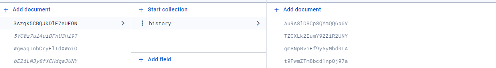
We can see it has 4 documents, each document is a history of the note, with the necessary fields.

At this point, we need to create components for our home page so the code won't be a mess. We created a `NoteList`, `NoteForm`, and `Header`. I think I could have "separated" more components, like a single note view from within the note list, but for the current state, it is working.

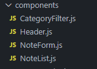

At this step, we can add Bootstrap to make the app look better. Bootstrap is a CSS framework that allows us to style our app with ease, and it is very popular. You have two options when using React:

- Use the original Bootstrap - just add the Bootstrap `<link>` tag to the `index.html` file in the public folder.
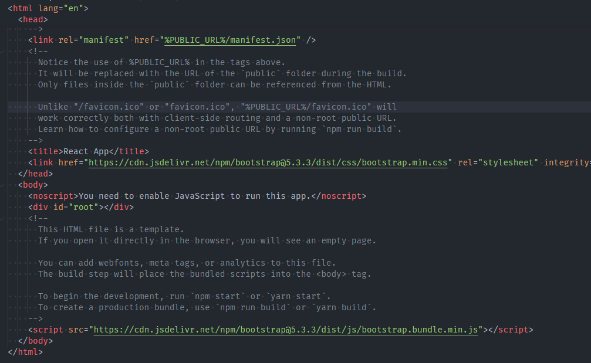

- Use React-Bootstrap - a React component library that uses Bootstrap under the hood.

## Some examples of using Bootstrap in this project

- [Bootstrap Introduction](https://getbootstrap.com/docs/5.3/getting-started/introduction/)

    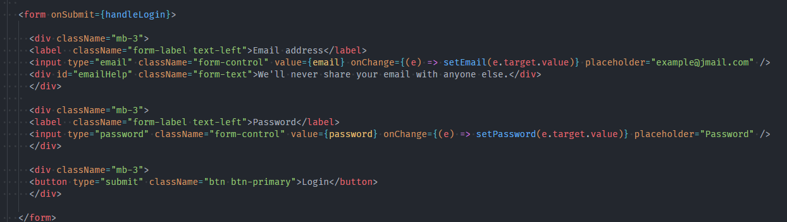
    You can see the `className` properties are Bootstrap classes that style the elements, which results in nicely looking components:
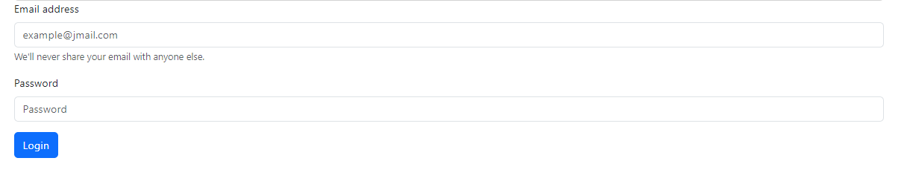

The most important usage of Bootstrap in this application, in my opinion, is the `ToastNotification` component that shows a toast notification to the user. Example:
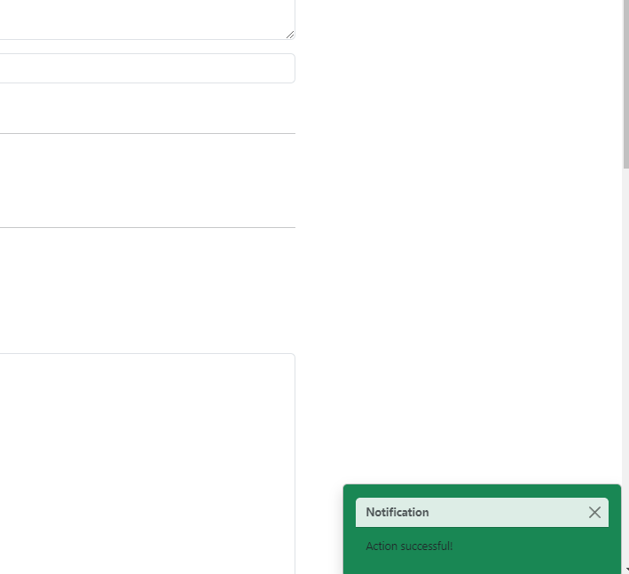
In order to use this well and across our app, we created a context for the notification.

Notification context:

```javascript
import React, { createContext, useContext, useState } from 'react';

const NotificationContext = createContext();

export const useNotification = () => useContext(NotificationContext);

export const NotificationProvider = ({ children }) => {
  const [notification, setNotification] = useState({
    show: false,
    message: '',
    type: 'success' // default type
  });

  const notify = ({ message, type = 'success' }) => {
    console.log('notify', message, type);
    setNotification({ show: true, message, type });
    setTimeout(() => {
      setNotification((prev) => ({ ...prev, show: false }));
    }, 3000);
  };

  return (
    <NotificationContext.Provider value={{ notification, notify }}>
      {children}
    </NotificationContext.Provider>
  );
};
```

The toast notification component:

```javascript
import React from 'react';
import { useNotification } from '../NotificationContext';

const ToastNotification = () => {
  const { notification } = useNotification();

  if (!notification || !notification.show) {
    return null;
  }

  return (
    <div className={`toast show position-fixed bottom-0 end-0 p-3 bg-${notification.type}`} style={{ zIndex: 5 }}>
      <div className="toast-header">
        <strong className="me-auto">Notification</strong>
        <button type="button" className="btn-close" onClick={() => {/* Close logic here */}}></button>
      </div>
      <div className="toast-body">
        {notification.message}
      </div>
    </div>
  );
};

export default ToastNotification;
```

So now we can use the notify function from the notification context to show a toast notification to the user no matter where he is in the app.

In the rest of the application, we have created a set of categories to "filter" the notes by category, and a
sort notes by date created option.
the main page after login looks like this:
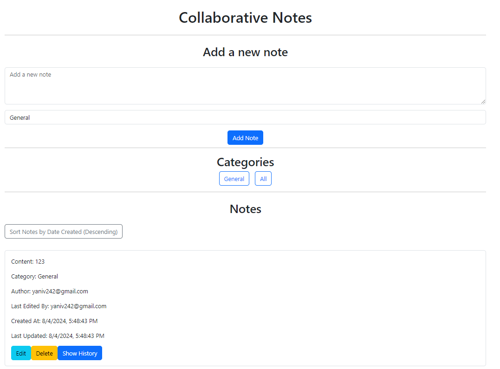

The user can add notes, edit notes, delete notes, and revert notes to previous versions.

Example of a history of a note:
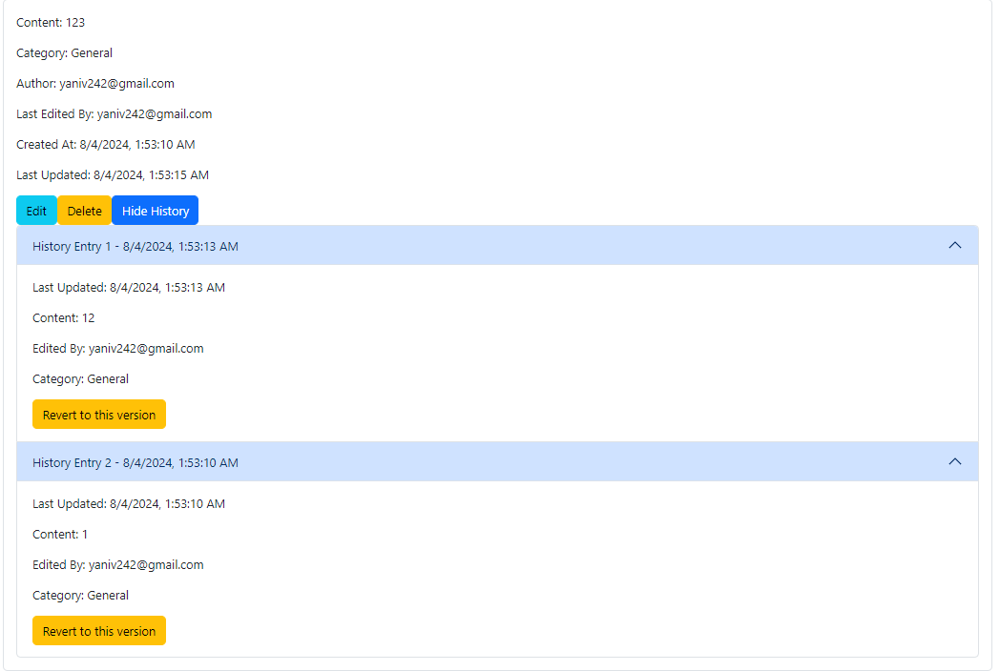

Editing view:
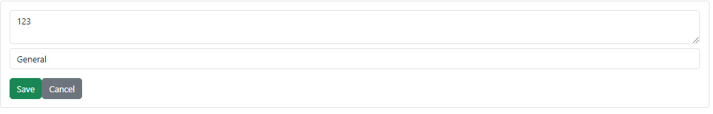

## Summary

The development process of the Collaborative Notes app involved integrating various technologies such as React for the frontend, Firebase for authentication and live data storage, and Bootstrap for styling. The use of Firebase allowed for real-time data handling and secure user authentication. React's component-based architecture facilitated an organized codebase, while Bootstrap enhanced the UI with minimal effort. Features like user authentication, note handling (add, delete, edit, and history tracking), and live updates were implemented to create a robust note-taking platform.
